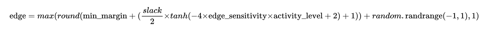
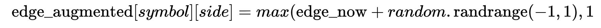
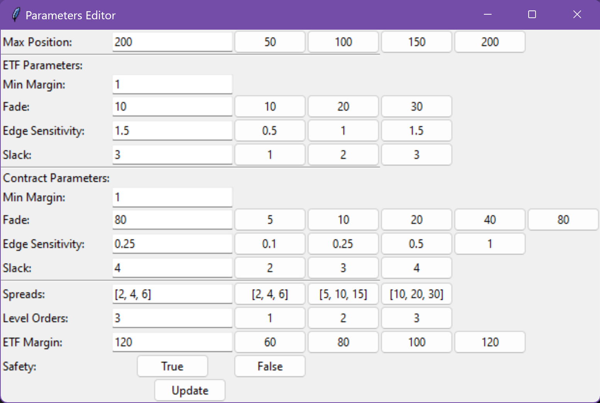
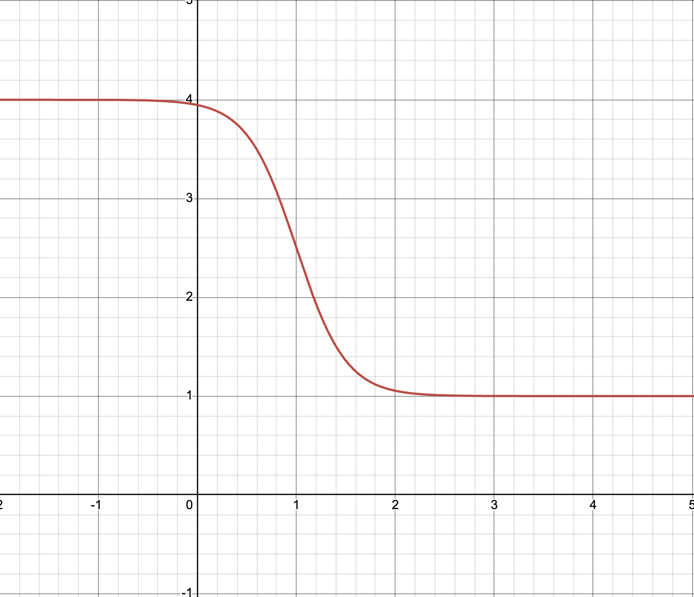
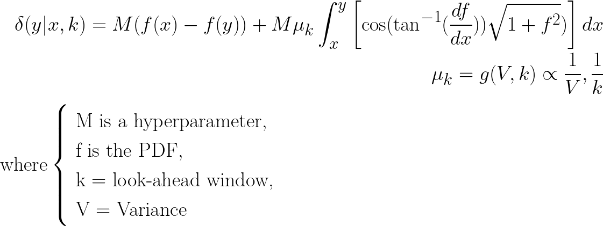
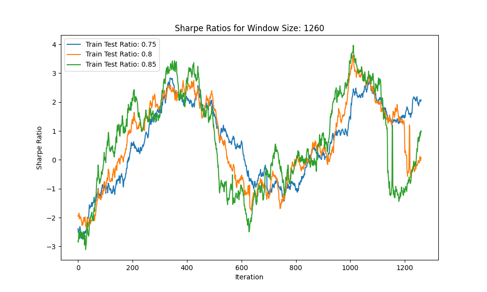
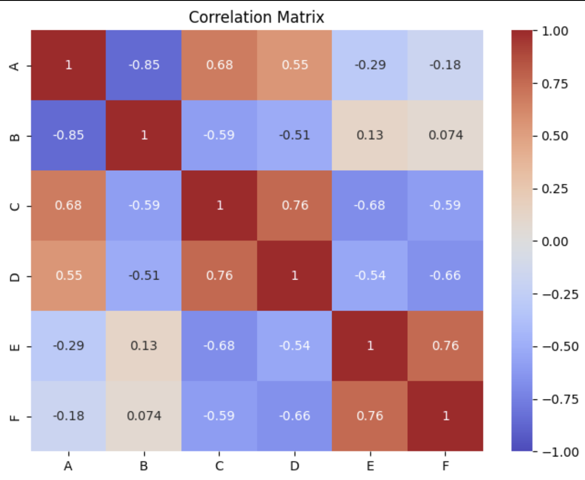

# UChicago Trading Competition 2024
## Team UChicago x UMass Amherst
- <a href="https://github.com/coolkite/">Divyansh Shivashok</a>, 2024 AI / ML SWE Intern @ Microsoft, 2x USNCO (US Chemistry Olympiad) Top 50, AI Research @ UMass Computer Graphics Lab, MIT CSAIL
- <a href="https://github.com/dmtrung14/">Trung Dang</a>, 2x Vietnam Math Olympiad Top 25, AI Research @ UMass Dynamic and Autonomous Robotic Systems (DARoS) Lab
- <a href="https://github.com/zaranip/">Zara Nip</a>, 2024 Risk Quant Intern @ PIMCO, AI Break Through Tech Scholar, Girls Who Invest Scholar, AnitaB.org Scholar, UChicago Financial Markets Scholar

<p align="center">
  
</p>


Please contact us at dshivashok@umass.edu, tmdang@umass.edu, or znip@uchicago.edu with any questions or concerns.
## Table of Contents
<!-- TABLE OF CONTENTS -->
  <ol>
    <li><a href="#general-thoughts">General Thoughts</a></li>
    <li>
      <a href="#getting-started">Getting Started</a>
      <ul>
        <li><a href="#installation">Installation</a></li>
      </ul>
    </li>
    <li><a href="#case-1-market-making">Case 1</a></li>
    <li><a href="#case-2-portfolio-optimization">Case 2</a></li>
    <li><a href="#takeaways">Takeaways</a></li>
  </ol>
</details>

## General Thoughts
This year's competition included a live market making simulation (Case 1) and a portfolio optimization case (Case 2) from April 12-13. This was the first time some of us had ever attempted to anything related to quantitative finance - and also the first time that UMass Amherst was invited to the competition in all 12 years of its running (hopefully not the last!).

The event and case studies were very carefully planned, and we enjoyed every minute of it. Kudos to the team behind the competition.

If you are a recruiter and / or looking to hire in the quantitative finance field, please navigate to the resumes folder of this respository to find our resumes and contact information. We are currently recruiting for 2025 internships (Trung, Zara) and full-time positions (Divyansh).

<!-- GETTING STARTED -->
## Getting Started

Instructions on setting up our project locally.
To get a local copy up and running follow these simple example steps.


### Installation

1. Clone the repository
   ```sh
   git clone https://github.com/zaranip/Chicago-Trading-Competition-2024/
   ```
2. Navigate into the directory
   ```sh
   cd Chicago-Trading-Competition-2024
   ```
3. Install and activate relevant packages
  ```sh
  conda env create --name utc --file=environment.yaml
  conda activate utc
  ```

<p align="right">(<a href="#readme-top">back to top</a>)</p>

<!-- Case 1 -->
## Case 1: Market Making

### Strategies
1. **Penny in, Penny out with Levels**: This strategy involves placing orders at the best bid and ask prices, with the aim of capturing the bid-ask spread. The bot continuously adjusts its orders based on predefined levels to optimize its position in the order book.
2. **ETF Arbitrage**: The bot monitors the prices of exchange-traded funds (ETFs) and their underlying assets. It identifies and exploits price discrepancies between the ETF and its components, taking advantage of arbitrage opportunities.
3. **GUI Interface and Accessory Strategies**: The bot includes a graphical user interface (GUI) that allows us to monitor its performance and adjust settings in real-time. Additionally, the bot employs accessory strategies, such as placing bogus bids, to manipulate the market and gain an advantage over other participants. We suggest that future competitiors also employ this, but to make sure that you can do X11 port forwarding before the competition.
4. **Noise**: Because the price, margins, and bid / ask spreads are hard to predict, we added additional "noise" to make our models for fair price non-deterministic. We used random values several times in our code: volume of assets transacted, edge parameter value, and whether to buy or sell first (all else held equal).
5. **Safety Mechanism**: Stop trading if we are losing too much (included in the GUI).

The GUI allowed us to control fade (rate of selling / buying assets), edge (profit margin sensitivity), slack (max margin), and minimum margin. These can be found in our "params_gui.py" file. Our edge specifically uses a tanh function to adjust our margins and a logarithmic function to adjust the fades.

Here is the edge equation:
<p align="center">
  
  
</p>

Here is the fade equation:
<p align="center">
  
</p>

Here is what the final GUI looked like and the _base_ tanh function that we used to adjust the edge.
<p align="center">
  
  <br>
  
</p>

We used three different ways of evaluating fair value:
1. Potential energy graph for interaction between a proton and electron - we found the distributions of prices given to us fit very closely with this model. We did end up implementing this model in predictions.py, and it worked with varying results.
<p align="center">
  
  <br>
  
</p>
2. Kernel density estimation (KDE) distribution, using 50% marks to determine fair price on incoming data. <br>
<p align="center">
  
</p>

3. Last transacted price. We used this during our training rounds with great success. Unfortunately, the hitter bots (explained later) messed up these calculations.

### Challenges
During the development and deployment of the bot, we encountered a significant challenge posed by "hitter bots". These bots aggressively hit our orders, making it difficult for our market-making bot to function effectively. The hitter bots' actions disrupted our bot's ability to maintain its desired position in the order book and execute trades as intended.

To mitigate the impact of hitter bots, we implemented various countermeasures and refined our algorithms. However, the presence of these bots highlighted the importance of robust error handling, risk management, and continuous monitoring when operating in a highly competitive and fast-paced trading environment.


<p align="right">(<a href="#readme-top">back to top</a>)</p>

<!-- Case 2 -->
## Case 2: Portfolio Optimization

### Portfolio Optimization: Case 2

In this case study, we focus on the portfolio optimization process, specifically highlighting the passive-aggressive mean reversion strategy and the insights gained from exploratory data analysis (EDA).

#### Passive-Aggressive Mean Reversion Strategy

During the portfolio optimization phase, we implemented a passive-aggressive mean reversion strategy. This strategy aims to capitalize on the tendency of asset prices to revert to their long-term average over time. The strategy involves the following steps:

1. **Identification of Mean-Reverting Assets**: Through extensive analysis of historical price data, we identified assets that exhibited mean-reverting behavior. These assets were characterized by prices that tended to oscillate around a long-term average, deviating from it in the short term but eventually reverting back to the mean.

2. **K-Fold Cross Validation**: We used this validation method to test the volatility and general patterns of each strategy type (noted below). Here is an example of one graph that we generated, out of at least 30 such graphs. These graphs helped to solidify our trust in the PAMR model to outperform other strategies.

<p align="center">
  
</p>


#### Other Implemented Strategies
We implemented 9 strategies (besides PAMR) to test on the training data. Related graphs and results of these experiments can be found in the case_2 -> testing_metrics folder.
1. Heterogeneous multiple population particle swarm optimization algorithm (HMPPSO.py): https://ieeexplore.ieee.org/document/7257025
2. Mean-Variance Optimization (mvo.py): Industry-standard method for optimizing risk and return
3. Genetic Algorithm 1 (oh_genetic.py): https://www.sciencedirect.com/science/article/abs/pii/S1568494617305240
4. On-Line Portfolio Selection with Moving Average Reversion (OLMAR) (olmar.py): https://arxiv.org/ftp/arxiv/papers/1206/1206.4626.pdf
5. Optimizing Sharpe (optimize_sharpe.py): Tried all the optimization methods available through the Scipy library https://docs.scipy.org/doc/scipy/reference/generated/scipy.optimize.minimize.html.
6. Optimized Markowitz (optimized_markowitz.py): https://en.wikipedia.org/wiki/Modern_portfolio_theory
7. Particle Swarm Optimization (PSO) (pso.py) https://www.sciencedirect.com/science/article/abs/pii/S0957417411002818
8. Quantum-inspired Tabu Search algorithm improved by the quantum-not-gate (GNQTS) (qts.py): https://ieeexplore.ieee.org/abstract/document/8616267
9. Multiobjective Evolutionary Algorithms and Preselection Methods (qu_evolutionary.py): https://www.hindawi.com/journals/mpe/2017/4197914/
 
#### Insights from Exploratory Data Analysis (EDA)

During the exploratory data analysis phase, we made a crucial observation that supported the implementation of the passive-aggressive mean reversion strategy. While analyzing historical price data, we noticed that certain assets exhibited strong mean-reverting characteristics.

The EDA process involved the following steps:

1. **Data Visualization**: Price charts, correlation matrices, scree plots.
<p align="center">
  
</p>

3. **Statistical Tests**: We performed statistical tests, such as the Augmented Dickey-Fuller (ADF) test, to assess the stationarity of the price series. Stationary series are more likely to exhibit mean reversion, as they have a constant mean and variance over time.

4. **Autocorrelation Analysis**: We examined the autocorrelation of the price series to determine the presence of mean reversion. Negative autocorrelation, particularly at longer lags, indicated a tendency for prices to revert to their mean.

The insights gained from the EDA process provided strong evidence of mean-reverting behavior in certain assets. This information was instrumental in the development and implementation of the passive-aggressive mean reversion strategy within our portfolio optimization framework.

<p align="right">(<a href="#readme-top">back to top</a>)</p>

<!-- Takeaways -->
## Takeaways
**Case 1:**
<ul>
  <li>Don't overtrain on the training platform! Be aware of the impact of hitter bots. Being more conservative would have panned out better for us rather than having alternating rounds of $400k profit / -$400k loss because of hitter bots.</li>
  <li>Take advantage of the risk-free asset and buy up as many as possible.</li>
</ul>
<br>

**Case 2:**
<ul>
  <li>In the end, we submitted the algorithm with the best Sharpe, the PAMR model. One future consideration would be to make dynamically changing Sharpe, as this was not something that we knew was possible ;(.</li>
</ul>
<p align="right">(<a href="#readme-top">back to top</a>)</p>
